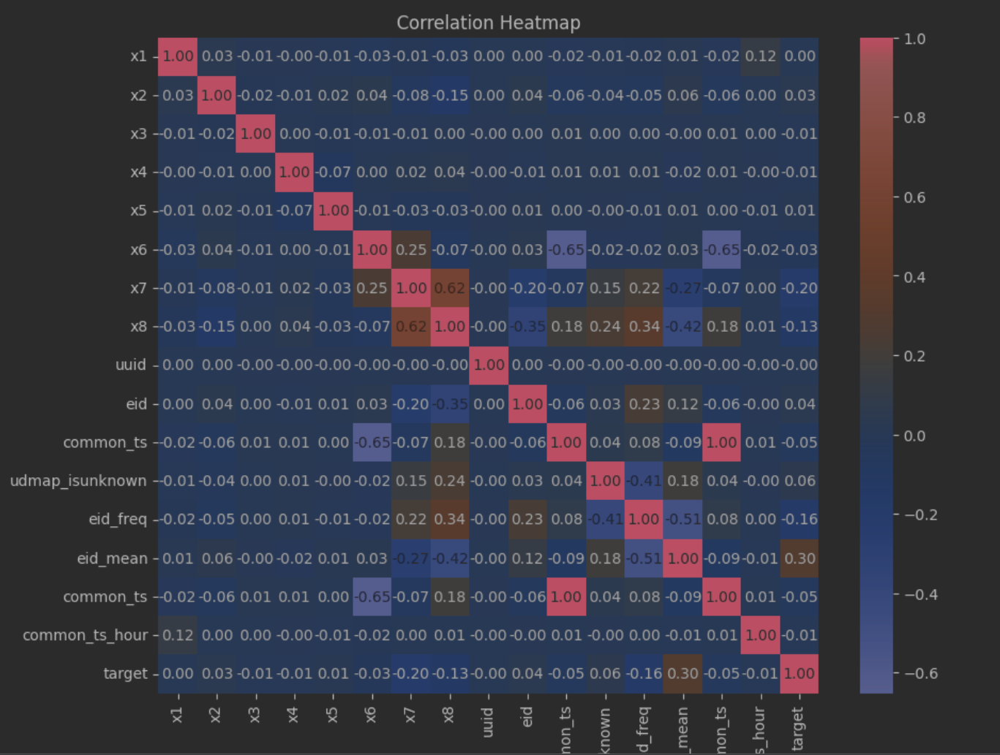
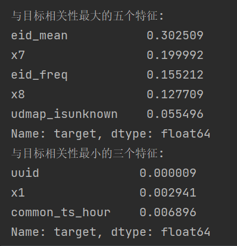

# Datawhale_AI_summer_camp-
AI夏令营学习项目，学习笔记
## 1.背景介绍
本项目基于讯飞开放平台，利用讯飞开放平台的应用数据作为训练样本，以预测用户的新增情况。
### 1.1相关链接

#### 1.1.1赛事地址：
https://challenge.xfyun.cn/topic/info?type=subscriber-addition-prediction&ch=ymfk4uU

#### 1.1.2打卡链接
https://jinshuju.net/f/Ua6jo7?x_field_1=7

#### 1.1.3学习手册
https://datawhaler.feishu.cn/docx/HBIHd7ugzoOsMqx0LEncR1lJnCf
#### 1.1.4一键运行baseline
https://aistudio.baidu.com/aistudio/projectdetail/6618108?contributionType=1&sUid=1020699&shared=1&ts=1691406191660

## 2.数据分析
在机器学习中，数据分析是指对数据进行探索、理解和解释的过程。
它是机器学习项目的关键步骤之一，旨在获取对数据的洞察，并为后续的建模和预测任务提供基础。

数据分析通常包括以下几个方面的内容：

1. 数据清理和预处理：这是数据分析的第一步，包括处理缺失值、处理异常值、数据标准化或归一化、处理重复值等。数据清理和预处理的目的是确保数据的质量和一致性，并为后续的分析和建模准备好合适的数据。
2. 描述性统计分析：通过计算数据集的基本统计量，例如均值、中位数、标准差、最大值和最小值等，来描述数据的特征和分布。这可以帮助我们了解数据的整体特征、发现异常情况以及获取数据的一些基本统计信息。
3. 可视化分析：利用图表、图形和可视化工具，将数据以可视化形式呈现，以便更好地理解数据的特征、趋势和关系。常见的可视化方法包括直方图、散点图、箱线图、热力图等。
4. 特征工程：特征工程是对原始数据进行转换和提取，以创建更有信息量的特征。这可能涉及特征选择、特征变换、特征组合等技术，以便为机器学习模型提供更好的输入
5. 相关性分析：通过计算特征之间的相关性，可以了解不同特征之间的关系，以及它们与目标变量之间的关系。这有助于选择具有预测能力的特征，或者发现特征之间的重要关联。

##### 下面简单介绍一下目前为止做的数据分析工作
#### 2.1统计分析工作

对相关数据的均值，出现频率等进行统计分析

```python
train_data['eid_freq'] = train_data['eid'].map(train_data['eid'].value_counts())
test_data['eid_freq'] = test_data['eid'].map(train_data['eid'].value_counts())

train_data['eid_mean'] = train_data['eid'].map(train_data.groupby('eid')['target'].mean())
test_data['eid_mean'] = test_data['eid'].map(train_data.groupby('eid')['target'].mean())
```

#### 2.2相关性分析

利用热力图直接展示数据间的关系，筛选出模型训练的可用特征





## 3.特征工程

在机器学习中，特征工程（Feature Engineering）是指对原始数据进行转换、选择和创建，以创建更有信息量和表达能力的特征的过程。特征工程是机器学习项目中至关重要的步骤，因为好的特征可以帮助模型更好地理解数据，提高模型的性能和预测能力。

特征工程的目标是通过对原始数据进行加工，提取出能够更好地表达数据的特征，以便机器学习模型能够更好地利用这些特征进行预测和建模。下面是一些常见的特征工程技术：

1. 特征选择（Feature Selection）：从原始特征集中选择最相关或最重要的特征，以减少特征维度、降低模型复杂度和提高模型训练效率。常用的特征选择方法包括方差选择法、卡方检验、互信息、L1正则化等。
2. 特征提取（Feature Extraction）：通过将原始数据进行变换或降维，提取出更具代表性和信息丰富度的特征。常见的特征提取方法包括主成分分析（PCA）、线性判别分析（LDA）、因子分析等。
3. 特征变换（Feature Transformation）：对原始特征进行数学变换或函数变换，以改变特征的分布或形式，使其更符合模型假设或提升模型性能。例如，对数变换、标准化、归一化等。
4. 特征组合（Feature Combination）：将多个原始特征组合成新的特征，以捕捉不同特征之间的交互作用和关联性。例如，多项式特征、交叉特征等。
5. 特征生成（Feature Generation）：基于原始数据创建新的特征，以丰富数据表达和增加模型的预测能力。这可以包括基于时间的特征、统计特征、文本处理特征、图像处理特征等。

## 4.模型迭代

这部分需要在原有Baseline基础上做更多优化，可以从特征工程与模型中来思考。
